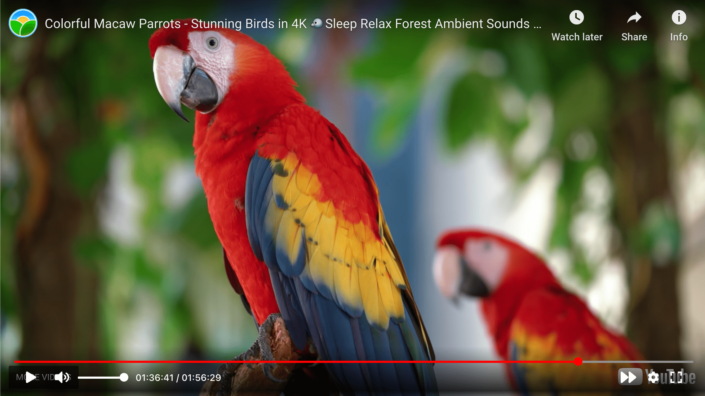

<!-- PROJECT LOGO -->
<br />
<p align="center">
  <a href="https://github.com/MaxiMittel/react-cp-youtube">
    
  </a>
  <h3 align="center">Custom Youtube Player</h3>

  <p align="center">
    <br />
    <a href="https://www.frnds.watch">See it in action</a>
    ·
    <a href="https://github.com/MaxiMittel/react-cp-youtube/issues">Report Bug</a>
    ·
    <a href="https://github.com/MaxiMittel/react-cp-youtube/issues">Request Feature</a>
  </p>
</p>

## Information

**NOTE: This is stil under development. Don't use in production.**

This React component wraps custom controls around a YouTube video for better information about what the user is doing.

## Preview



## Install

```sh
npm i react-cp-youtube
```

<!-- USAGE EXAMPLES -->

## Example

```tsx
import VideoPlayer, {YouTubeRef, YouTubeOptions} from "react-cp-youtube";
import 'react-cp-youtube/dist/bundle.css';

var player: YouTubeRef;

var opts = {
  autoplay: 1,
  playsinline: 1
}

...

<VideoPlayer
  playing={true}
  time={0}
  videoId={"7v6QXZWylpI"}
  options={opts}
  onTimeUpdate={(time: number) => console.log("TIME UPDATE: ", rate)}
  onPlay={() => console.log("PLAY")}
  onPause={() => console.log("PAUSE")}
  ytRef={(ref: YouTubeRef) => (player = ref)}
/>

...

const stopPlayer = () =>{
  if(player)
    player.getInternalPlayer().stopVideo();
}

```

<!-- CONTRIBUTING -->

## Props

Changing `playing`, `time`, `rate` or `videoId` will result in the player changing those attributes. E.g Changing `time` will result in the player skipping to the provided second.

| name                      | type                        | description                                                                                                                                       |
| ------------------------- | --------------------------- | ------------------------------------------------------------------------------------------------------------------------------------------------- |
| `playing`                 | `boolean`                   | Changes the video state to either playing or paused.                                                                                              |
| `time`                    | `number`                    | Sets the time in seconds.                                                                                                                         |
| `rate`                    | `number`                    | Sets the playback rate of the video.                                                                                                              |
| `videoId`                 | `string`                    | Sets the id of the video currently played.                                                                                                        |
| `options`                 | `YouTubeOptions`            | Sets the YouTube iframe parameters. More information [here](https://developers.google.com/youtube/player_parameters#Parameters).                  |
| `disableKb`               | `boolean`                   | If set to true all keyboard interactions will be blocked.                                                                                         |
| `ytRef`                   | `(ref: YouTubeRef) => void` | Will pass a reference to the js api of the iframe. More information [here](https://developers.google.com/youtube/iframe_api_reference#Functions). |
| `onPlaybackRateChange`    | `(rate: number) => void`    | Is triggered when the user changes the playback rate. (Coming soon)                                                                               |
| `onEnd`                   | `() => void`                | Is triggered when the current video finished playing.                                                                                             |
| `onTimeChange`            | `(time: number) => void`    | Is triggered when the user changes the time of the video.                                                                                         |
| `onTimeUpdate`            | `(time: number) => void`    | Called every `500ms` passes current time as parameter                                                                                             |
| `onPlay`                  | `() => void`                | Is triggered when the user resumes the video. (NOTE: A time change will trigger `onPlay` or `onPause`)                                            |
| `onPause`                 | `() => void`                | Is triggered when the user pauses the video. (NOTE: A time change will trigger `onPlay` or `onPause`)                                             |
| `onReady`                 | `() => void`                | Called when the state of the player changes to ready.                                                                                             |
| `onError`                 | `(error: number) => void`   | Handles errors of the YouTube iframe.                                                                                                             |
| `onPlaybackQualityChange` | `(quality: string) => void` | Called when the video quality of the player changed. Passes the new quality.                                                                      |
| `onStateChange`           | `(state: any) => void`      | Called when state of the player changes. Passes the new state.                                                                                    |

<!-- CONTRIBUTING -->

## Contributing

Contributions are what make the open source community such an amazing place to be learn, inspire, and create. Any contributions you make are **greatly appreciated**.

1. Fork the Project
2. Create your Feature Branch (`git checkout -b feature/AmazingFeature`)
3. Commit your Changes (`git commit -m 'Add some AmazingFeature'`)
4. Push to the Branch (`git push origin feature/AmazingFeature`)
5. Open a Pull Request

<!-- LICENSE -->

## License

Distributed under the MIT License. See `LICENSE` for more information.

<!-- CONTACT -->

## Contact

Maximilian Mittelhammer - [@maxi_maximittel](https://twitter.com/maxi_maximittel) - maximittel@outlook.de

Project Link: [https://github.com/MaxiMittel/react-cp-youtube](https://github.com/MaxiMittel/react-cp-youtube)
